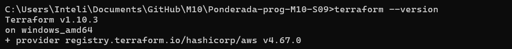
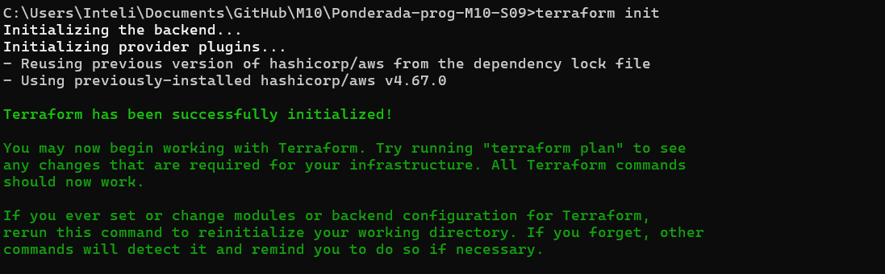
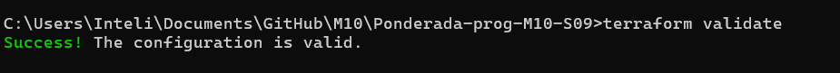
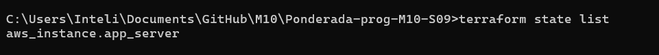

# Documentação do Tutorial Terraform com AWS

Este repositório documenta a utilização do Terraform para criação de uma infraestrutura como código (IaC) na AWS, seguindo os passos descritos no tutorial oficial da HashiCorp. O objetivo é criar uma instância EC2 e registrar todo o processo no README do repositório.


### 1. Configuração do Ambiente

#### 1.1. Instalação do Terraform

Baixe e configure o Terraform em seu sistema. Verifique a instalação com:

````
terraform --version
````



#### 1.2. Configuração das Credenciais da AWS

Obtenha as credenciais temporárias no ambiente AWS Academy.

Configure as variáveis de ambiente no terminal:

````
set AWS_ACCESS_KEY_ID=<sua-chave>
set AWS_SECRET_ACCESS_KEY=<sua-chave-secreta>
set AWS_SESSION_TOKEN=<seu-token>
````

Verifique a configuração com:

````
aws sts get-caller-identity
````

#### 1.3. Criação do Arquivo main.tf

Crie o arquivo main.tf com o seguinte conteúdo:

````
provider "aws" {
  region = "us-west-2"
}

resource "aws_instance" "app_server" {
  ami           = "ami-830c94e3"
  instance_type = "t2.micro"

  tags = {
    Name = "ExampleAppServerInstance"
  }
}
````

### 2. Execução dos Comandos do Terraform

#### 2.1. Inicialização do Terraform

Execute:

````
terraform init
````




#### 2.2. Validação e Formatação

Valide o arquivo:

````
terraform validate
````



#### 2.3. Aplicar o Plano

Execute o comando:

````
terraform apply
````


Revise o plano, digite yes para confirmar.


### 3. Verificação dos Recursos Provisionados

#### 3.1. Listar Recursos

Liste os recursos provisionados:

````
terraform state list
````



#### 3.2. Detalhes da Instância EC2

Obtenha detalhes da instância criada:

````
terraform show
````


#### 3.3. Console AWS

### Conclusão

A utilização do Terraform para provisionar uma infraestrutura na AWS traz diversos benefícios. Este processo automatiza a criação e gerenciamento de recursos, reduzindo o risco de erros manuais e facilitando a reprodutibilidade do ambiente. A infraestrutura como código (IaC) também permite que equipes trabalhem de forma colaborativa e mantenham o controle de versões dos seus recursos na nuvem.
